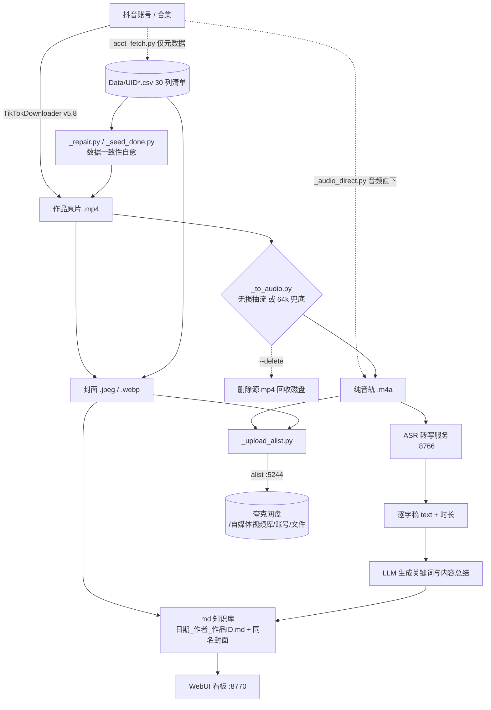

# 自媒体脚本知识库

> 抖音内容资产管理流水线 —— 从「账号采集」到「逐字稿知识库」的全自动闭环。

把若干个抖音账号（以及指定合集）的作品，自动变成**结构化逐字稿知识库**，并同步归档到云盘。
全流程无人值守，每天定时跑两轮。

**三段核心：下载视频 → 转换音频 → 文案转写。**
围绕这三段，还长出了一整套工程化的「旁路」能力：命名规范化、封面补齐、数据自愈、
音频直下、合集采集、磁盘闸门、云端归档、每日自动化。

---

## 1. 功能一览

| # | 能力 | 说明 | 入口 |
|---|---|---|---|
| 1 | **账号增量采集** | 批量下载 N 个抖音账号的全部作品（原画）；工具自带增量去重 | `core/01-download/_pipeline.py` |
| 2 | **合集采集** | 按 collection 链接采集指定合集（长播客） | `core/01-download/_dl_mix.py` |
| 3 | **新账号入库** | 只拉元数据清单（30 列 CSV）+ 封面，不下载视频 | `core/01-download/_acct_fetch.py` |
| 4 | **音频直下** | 绕过视频，直接从接口拉纯音轨（省约 88% 体积） | `core/01-download/_audio_direct.py` |
| 5 | **视频转音频** | mp4 → m4a 无损抽流，可选删除源视频 | `core/02-audio/_to_audio.py` |
| 6 | **文案转写** | ASR 转写 → 逐字稿 + LLM 摘要 → md 知识库 | `core/03-asr/` · 主程序 `媒体知识库/asr_batch.py` |
| 7 | **命名规范化** | 统一为 `{发布日期}_{账号昵称}_{作品ID}.ext` | `core/04-maintain/_rename.py` |
| 8 | **封面审计补齐** | 三级兜底（CSV 静态 → CSV 动态 → Detail 接口）补齐缺失封面 | `core/04-maintain/_cover_audit_fix.py` |
| 9 | **数据自愈** | 修复「库有记录但文件缺失」的幽灵记录 + 孤儿缓存 | `core/04-maintain/_repair.py` |
| 10 | **下载记录回填** | 已落盘作品写回 DB，防止次日重复下载视频 | `core/04-maintain/_seed_done.py` |
| 11 | **云端归档** | 经本地 alist 增量上传夸克网盘（m4a + 封面） | `core/05-cloud/_upload_alist.py` |
| 12 | **磁盘闸门** | 空间不足时先回收残留 mp4，仍不足则放弃本次下载 | `core/01-download/_pipeline.py :: ensure_space()` |
| 13 | **每日自动化** | 18:00 采集链 + 20:00 归档链，跑完自检并要求「双 0」 | WorkBuddy automation |

---

## 2. 架构



**目录分工（两库分离）**

| 目录 | 角色 | 产物 |
|---|---|---|
| `D:\视频\自媒体视频库` | **采集侧**：下载 + 转音频 + 数据校验 + 云端归档 | `UID*_发布作品/`、`MID*_合集作品/`、`Data/*.csv` |
| `D:\视频\媒体知识库`   | **知识侧**：ASR 转写 + LLM 摘要 + 看板 | `<作者>/日期_作者_作品ID.md` + 同名封面 |
| `D:\视频\自媒体脚本知识库` | **本仓库**：文档 + 核心代码快照 | `README.md`、`docs/`、`core/` |

---

## 3. 典型数据规模（示例）

> 下面是一套实际在跑的实例，用于说明量级；账号清单本身在配置里，可任意增删。

| 账号 / 合集 | 作品数 | 音轨 m4a | 封面 |
|---|---:|---:|---:|
| 巫师财经 | 418 | 418 | 418 |
| 魏远麟律师 广州 | 190 | 190 | 192 |
| 阿库财经Finance | 117 | 115 | 117 |
| 罗天行 | 108 | 94 | 271 |
| 钦文和他的朋友们 | 90 | 90 | 90 |
| 播客正片合集（罗永浩的十字路口） | 37 | 37 | 37 |
| 识藏 | 27 | 27 | 54 |
| 这很容易 | 23 | 23 | 23 |
| **合计** | **1010** | **994** | **1202** |

- 云端归档：**2196** 个文件 / **8797 MB**，0 失败（8 个账号目录，夸克顶层 `自媒体视频库/`）。
- 转写侧：任务 994 条，累计出 md 数百篇；剩余以长切片为主（数十小时音频）。
- 存储策略：`.m4a` 为长期留存形态；`.mp4` 抽完音轨即删（省 80%+ 磁盘）。

---

## 4. 目录结构

```
自媒体脚本知识库/
├── README.md                    本文件：项目介绍 + 功能 + 架构
├── index.html                   单页可视化介绍（浏览器直接打开 / GitHub Pages 首页）
├── LICENSE                      MIT（仅覆盖本仓库自有代码）
├── .gitignore
├── _sync_core.py                从实盘同步 core/ 快照（自动脱敏 + 校验）
├── docs/
│   ├── 01-架构总览.md            两库分离、数据流、关键设计取舍
│   ├── 02-下载视频.md            账号/合集/新账号三种采集方式 + 分页风控
│   ├── 03-转换音频.md            抽流策略、音频直下、体积对比
│   ├── 04-文案转写.md            ASR 接口、切片、注册表、LLM 摘要、看板
│   ├── 05-命名与封面.md          命名规范、封面三级兜底、合集特例
│   ├── 06-数据校验与自愈.md       幽灵记录、孤儿缓存、双 0 终检
│   ├── 07-云端归档.md            alist 认证、上传协议、缓存陷阱
│   ├── 08-每日自动化.md          两条自动化链路与失败处置
│   ├── 09-踩坑与排障.md          全部实战坑位与修法索引
│   └── 10-Docker部署.md          容器化：架构、路径兼容层、迁移与回滚
├── deploy/docker/                ★ Docker 部署套件（详见其 README）
│   ├── Dockerfile               两阶段构建：运行时（Python/ffmpeg/socat），代码与数据 bind mount
│   ├── docker-compose.yml       整条链编排（默认 / cron / job / cloud / llm 五种 profile）
│   ├── wb_compat/               路径兼容层：让硬编码 Windows 路径的实盘脚本零改动跑在容器里
│   ├── scripts/                 wbctl 调度入口 / 容器内定时 / 端口中继
│   └── run.sh                   命令封装（init / check / up / dry / step / shell）
└── core/                         核心代码快照（按阶段分目录）
    ├── 00-config/                脱敏配置模板
    ├── 01-download/              采集与直下
    ├── 02-audio/                 音视频转换
    ├── 03-asr/                   转写的接口层与渲染守护
    ├── 04-maintain/              命名 / 封面 / 数据自愈
    ├── 05-cloud/                 云端归档
    └── 06-tools/                 通用运行辅助
```

`core/` 是**实盘脚本的快照副本**，用于阅读与二次开发；实盘脚本仍在各自工作目录里运行。
改动实盘后执行 `python _sync_core.py --apply` 重新同步（默认 dry-run 列出差异）。

---

## 5. 快速开始

### 5.1 环境

- Windows 10/11（依赖 Win32 API 做原子删除、进程存活判断）
- Python 3.10+（采集侧建议独立 venv；ASR 侧使用带 `requests/flask` 的解释器）
- ffmpeg（推荐 `imageio-ffmpeg` 自带的静态二进制，免安装）
- [TikTokDownloader](https://github.com/JoeanAmier/TikTokDownloader) v5.8（GPL-3.0，**未随本仓库分发**）

### 5.2 采集侧一次性准备

```bash
cd D:\视频\自媒体视频库

# 1) 放置 TikTokDownloader 到 _tools/TikTokDownloader
# 2) 配置 Cookie（见 core/00-config/ 模板），写入 tools 的 Volume/settings.json
#    重点：accounts_urls[].earliest 首次全量必须留空，否则会提前终止
# 3) 首次全量
python _tools/TikTokDownloader/_pipeline.py
```

### 5.3 日常一轮完整链路（采集侧）

```bash
python _tools/TikTokDownloader/_repair.py --apply   # ① 先修数据，缺文件的记录放行重下
python _tools/TikTokDownloader/_pipeline.py         # ② 账号增量采集（含磁盘闸门 + 自动改名）
python _dl_mix.py                                   # ③ 合集增量采集
python _to_audio.py --delete                        # ④ mp4 → m4a 并删源
python _seed_done.py --apply                        # ⑤ 已落盘作品回填 DB
python _cover_audit_fix.py                          # ⑥ 封面审计补齐
```

### 5.4 转写侧

```bash
cd D:\视频\媒体知识库
set WB_SOURCE=lib
python asr_batch.py stage1        # 转写（长视频自动切片）
python _stage2_daemon.py          # 渲染 md（关键词 + 总结 + 封面）
```

### 5.5 云端归档

```bash
cd D:\视频\自媒体视频库
python _upload_alist.py                 # 默认 dry-run：列出待上传
python _upload_alist.py --apply --jobs 3
```

---

## 6. 数据与命名约定

### 6.1 文件命名

```
账号作品： {发布日期}_{账号昵称}_{作品ID}.{ext}
          2026-05-11_AAA麟西_7638279848310361009.m4a
图集多图： {发布日期}_{账号昵称}_{作品ID}_{n}.jpeg
合集作品： {YYYY-MM-DD HH.MM.SS}-视频-{合集名}-{标题}.m4a
```

> ⚠️ **合集目录不参与自动改名**（工具原始命名，文件名里没有作品ID），
> 所有「按文件名判断存在性」的脚本都必须**同时接受两种前缀**，否则会误判整批合集缺失。

### 6.2 元数据 CSV

工具导出 `Data/UID{uid}_{昵称}_发布作品.csv`，**30 列**且与工具内部记录同格式：

`作品类型 / 采集时间 / UID / SEC_UID / ID / 作品ID / 作品描述 / 作品话题 / 视频时长 /
视频高度 / 视频宽度 / 作品链接 / 发布时间 / 视频URI / 账号昵称 / 年龄 / 账号签名 /
下载地址 / 音乐作者 / 音乐标题 / 音乐链接 / 静态封面 / 动态封面 / 隐藏标签 /
点赞数量 / 评论数量 / 收藏数量 / 分享数量 / 播放数量 / 额外信息`

**读 CSV 一律按列名取值，不要按位置索引**（早期 6 列版本已被覆盖过）。

### 6.3 逐字稿 md

```markdown
作者 / 抖音账号 / 作品ID(链接) / 视频标题 / 发布时间 / 关键词(4 个、顿号)
视频封面：
-----
## 视频内容总结
### 视频核心主旨 / ### 核心干货要点 / ### 内容整体逻辑
-----
## 逐字稿
<正文>
```

逐字稿与封面**同名不同扩展名**，成对存放。

---

## 7. 每日自动化

| 时间 | 链路 | 内容 |
|---|---|---|
| **18:00** | 采集链 | 磁盘预检 → `_repair.py` → `_pipeline.py`(N 账号) → `_dl_mix.py`(合集) → `_to_audio.py --delete` → `_seed_done.py` → `_cover_audit_fix.py` → **双 0 终检** → 汇报 |
| **20:00** | 归档链 | `_upload_alist.py --apply --jobs 3` 增量上传夸克（冷却 15 分钟，避免与采集链抢文件） |

终检口径：`_repair.py` 缺失计数 = 0 **且** `_seed_done.py` 待回填计数 = 0。
详见 [docs/08-每日自动化.md](docs/08-每日自动化.md)。

---

## 8. 关键设计取舍（为什么这么写）

1. **音频优先于视频**：ASR 只吃声音。音频直下 + 抽流后删源，磁盘占用降到约 1/8。
2. **两库分离**：采集侧可以粗暴地重建、删文件；知识侧（逐字稿）是**只增不删**的资产。
3. **一切以 CSV 为准**：CSV 是元数据权威来源；文件系统状态只是它的投影。
   自愈类脚本（`_repair` / `_seed_done`）都用 CSV 反查文件系统。
4. **DB 只是加速缓存**：工具 DB 的 `download_data(ID)` 决定「跳过什么」。
   记录与文件不一致 → 用 `_repair.py` 删记录（重下）、用 `_seed_done.py` 补记录（防重下）。
   **两者必须成对使用**。
5. **不在上传链路里回查单文件**：alist 目录列表有缓存，上传后立刻 `get` 会「假失败」；
   改为按目录批量 `refresh` 比对体积。
6. **长任务必须可续跑**：切片、上传、增量下载全部支持断点续跑，进程被杀不丢进度。

---

## 9. 文档索引

> 偏好图形化阅读？浏览器打开 [index.html](index.html) —— 单页可视化介绍，含功能矩阵、架构图与每日自动化时间线。

| 文档 | 内容 |
|---|---|
| [docs/01-架构总览.md](docs/01-架构总览.md) | 数据流、两库职责、端到端时序 |
| [docs/02-下载视频.md](docs/02-下载视频.md) | 三种采集方式、增量机制、分页风控修复 |
| [docs/03-转换音频.md](docs/03-转换音频.md) | 抽流/重编码、音频直下、回退策略 |
| [docs/04-文案转写.md](docs/04-文案转写.md) | ASR 服务接口、切片拼接、注册表、LLM、看板 |
| [docs/05-命名与封面.md](docs/05-命名与封面.md) | 命名规范、封面兜底链、合集特例 |
| [docs/06-数据校验与自愈.md](docs/06-数据校验与自愈.md) | 幽灵记录/孤儿缓存、双 0 终检 |
| [docs/07-云端归档.md](docs/07-云端归档.md) | alist 认证、上传协议、状态库、性能 |
| [docs/08-每日自动化.md](docs/08-每日自动化.md) | 两条链路的完整命令与失败处置 |
| [docs/09-踩坑与排障.md](docs/09-踩坑与排障.md) | 全部实战坑位索引 |
| [docs/10-Docker部署.md](docs/10-Docker部署.md) | 容器化：架构、路径兼容层、定时迁移、回滚 |
| [deploy/docker/README.md](deploy/docker/README.md) | Docker 套件完整说明（机制、已验证/未验证清单、排障表） |

---

## 10. 声明

- 本仓库仅包含**自有编排代码与文档**，不包含任何第三方工具的源码。
- 依赖的 [TikTokDownloader](https://github.com/JoeanAmier/TikTokDownloader) 为 **GPL-3.0** 许可，需自行获取。
- 仓库内**不含**任何 Cookie、令牌、密钥；所有凭据均由脚本从工作目录外的文件读取（见 `.gitignore`）。
- 请遵守目标平台的服务条款与著作权规定，仅将本流水线用于**获得授权的内容归档与学习研究**。
